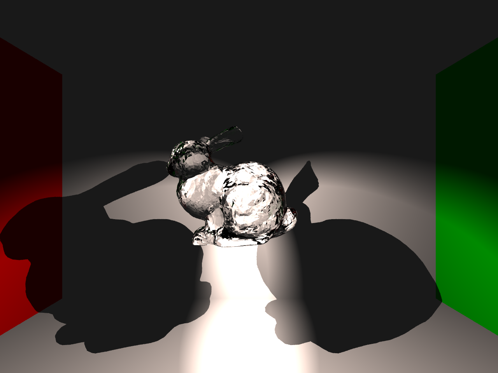
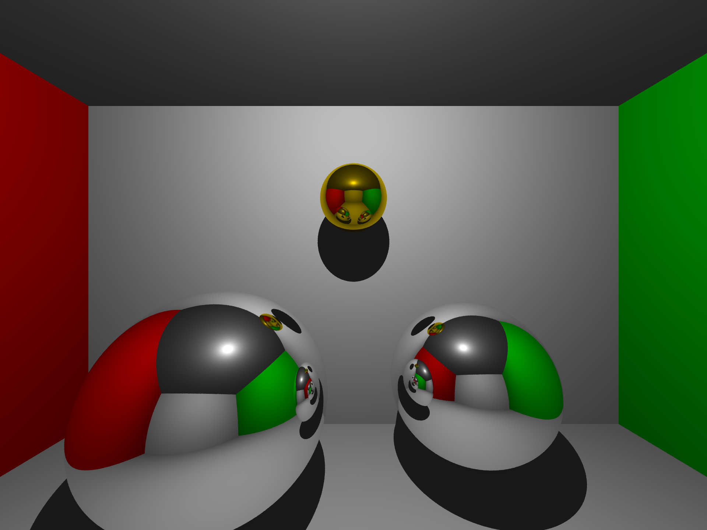
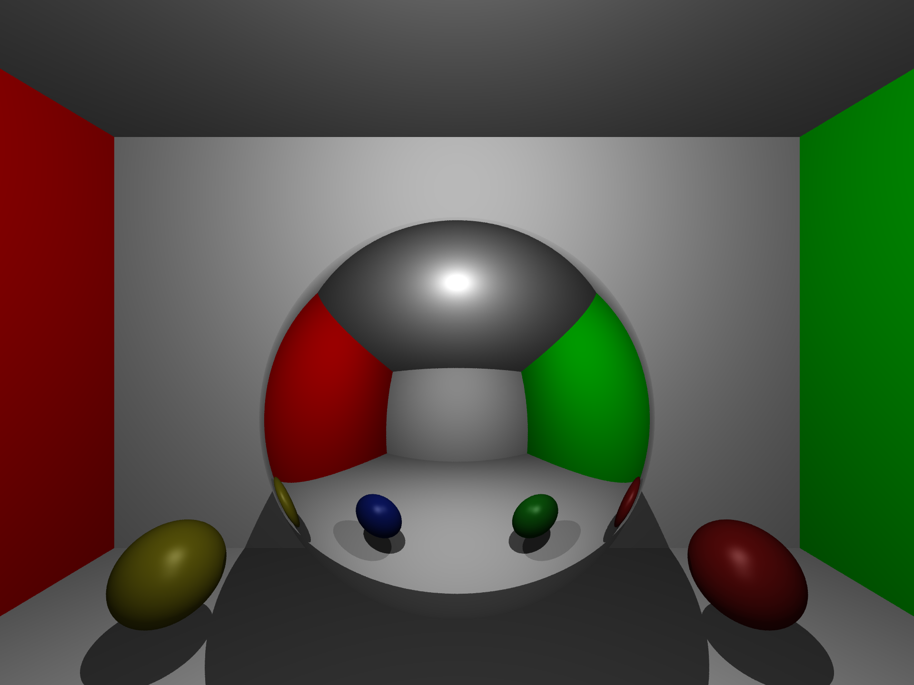
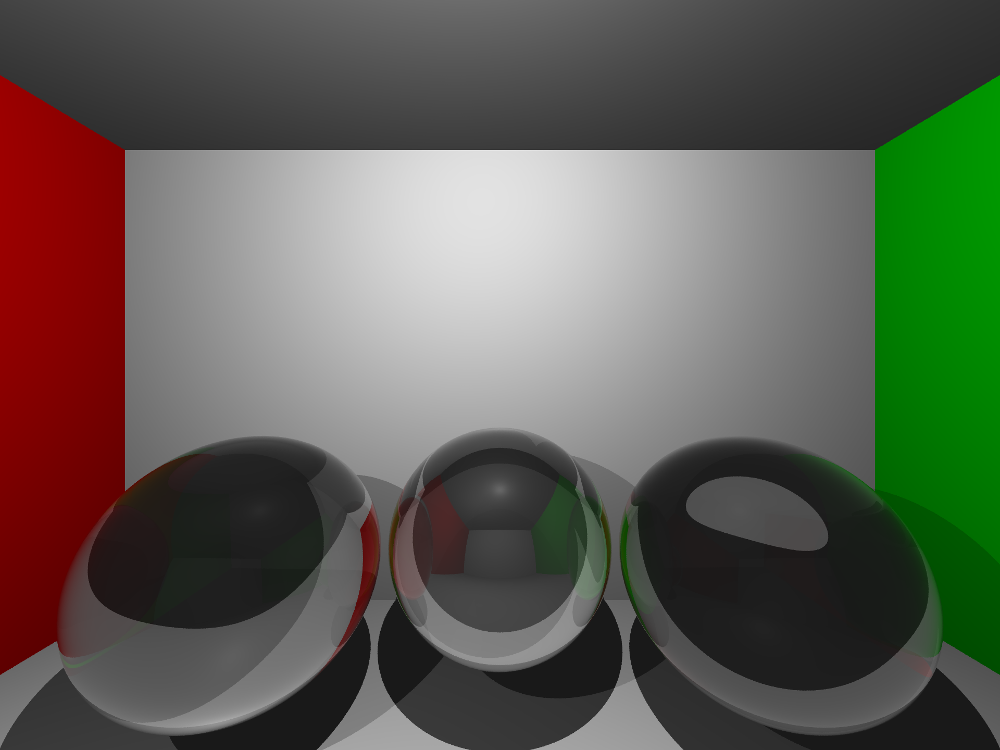
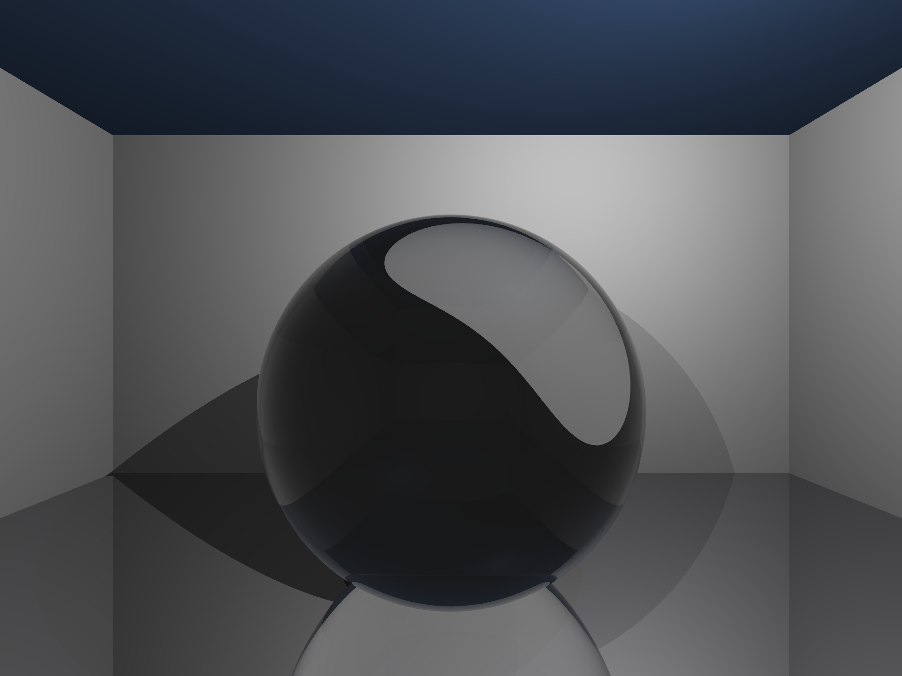

# RayTracer

A simple CPU-based ray tracer implementing the Blinn-Phong illumination model with support for reflections and refractions using Schlick's approximation for Fresnel effects.

> **⚠️ Warning: Experimental Learning Project**  
> This is an **educational project for learning purposes only**. Please note:
> - **CPU-based rendering**: Extremely slow performance as it processes each pixel sequentially on the CPU
> - **Not production-ready**: This is purely for understanding ray tracing fundamentals
> - **Limited scope**: For a more complete and performant implementation, I'm currently developing a **Rust + WGPU based path tracer** with GPU acceleration

## Table of Contents

- [Features](#features)
- [Gallery](#gallery)
- [Installation](#installation)
- [Usage](#usage)
- [Project Structure](#project-structure)
- [Notes](#notes)
- [License](#license)

## Features

- **Blinn-Phong Shading Model**: Classic physically-based lighting with ambient, diffuse, and specular components
- **Reflections**: Mirror-like surfaces with configurable reflectivity
- **Refractions**: Glass and transparent materials with customizable Index of Refraction (IOR)
- **Schlick's Approximation**: Realistic Fresnel effects for dielectric materials
- **Multiple Light Sources**: Support for point lights and spotlights
- **OBJ Model Loading**: Import and render 3D models with octree acceleration
- **Anti-aliasing**: Configurable multi-sampling for smoother results

## Gallery

### Glass Bunny with Spotlights


### Mirror Reflections


### Reflections Test


### Glass Spheres with Different IOR


### Water Drop


## Installation

1. Clone the repository:
```bash
git clone https://github.com/nasselk/CPU-RayTracer
cd RayTracer
```

2. Install dependencies:
```bash
pip install -r requirements.txt
```

## Usage

### Running the Ray Tracer

Simply run the main script:
```bash
python src/main.py
```

This will render all scenes defined in [src/main.py](src/main.py) and save them to the `output/` folder.

### Creating a Custom Scene

1. Create a new scene file in [src/scenes/](src/scenes/):

```python
# src/scenes/my_scene.py
from glm import vec3
from classes.objects.sphere import Sphere
from classes.scene import Scene
from classes.material import Material
from classes.lights.light import Light

def createMyScene(scene: Scene) -> None:
    # Add a reflective sphere
    scene.addObjects(
        Sphere(
            center=vec3(0, 0, -3), 
            radius=1.0, 
            material=Material(
                color=vec3(1, 1, 1), 
                diffuse=0.3, 
                reflectivity=0.7
            )
        )
    )
    
    # Add a glass sphere
    scene.addObjects(
        Sphere(
            center=vec3(2, 0, -3), 
            radius=1.0, 
            material=Material(
                color=vec3(1, 1, 1), 
                diffuse=0.0, 
                refractivity=1.0, 
                IOR=1.5  # Glass
            )
        )
    )
    
    # Add lights
    scene.addLights(
        Light(origin=vec3(0, 5, 0), intensity=1.5)
    )
```

2. Import and add your scene to [src/main.py](src/main.py):

```python
from scenes.my_scene import createMyScene

def main():
    camera = Camera(fov_y=90, position=vec3(0, 0, 0), target=vec3(0, 0, -1))
    renderer = Renderer(camera, SCREEN_WIDTH, SCREEN_HEIGHT, SAMPLES, MAX_DEPTH)
    
    scenes = [
        ("my_scene", createMyScene),  # Add your scene here
    ]
    
    for name, createScene in scenes:
        print(f"Rendering {name}...")
        scene = Scene()
        createScene(scene)
        renderer.clear()
        renderer.render(scene)
        renderer.save(f"./output/{name}.png")
        print(f"Saved {name}.png")
```

3. Run the renderer:
```bash
python src/main.py
```

### Material Properties

- `color`: RGB color vector (vec3)
- `diffuse`: Diffuse reflection coefficient (0.0 to 1.0)
- `reflectivity`: Mirror reflection coefficient (0.0 to 1.0)
- `refractivity`: Transparency coefficient (0.0 to 1.0)
- `IOR`: Index of Refraction (e.g., 1.0 for air, 1.33 for water, 1.5 for glass, 2.4 for diamond)

## Project Structure

```
RayTracer/
├── src/
│   ├── main.py              # Entry point
│   ├── constants.py         # Configuration constants
│   ├── classes/             # Core classes
│   │   ├── camera.py
│   │   ├── material.py
│   │   ├── ray.py
│   │   ├── renderer.py
│   │   ├── scene.py
│   │   ├── lights/          # Light implementations
│   │   └── objects/         # Geometric objects
│   ├── scenes/              # Scene definitions
│   └── utils/               # Utility functions
├── output/                  # Rendered images
└── requirements.txt         # Python dependencies
```

## Notes

The inline documentation (JSDoc comments) and portions of this README (not the code) were partially written with AI assistance.


## License

This project is released under the MIT License — see the included LICENSE file for details.